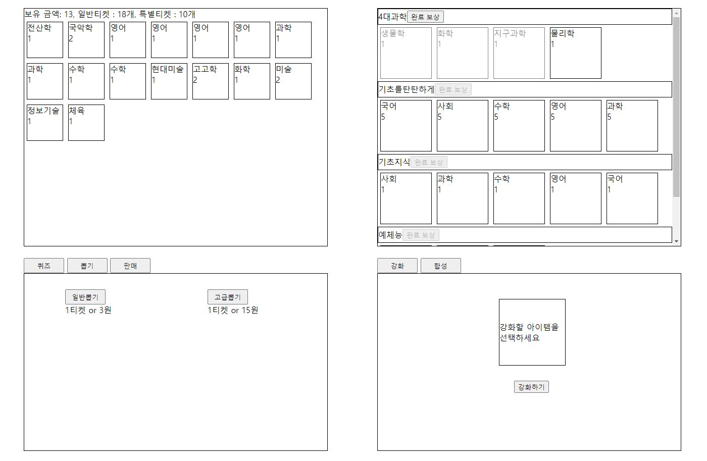
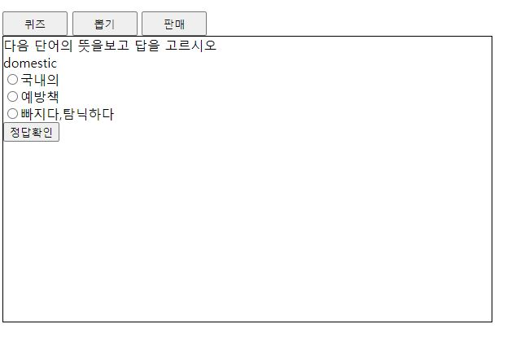
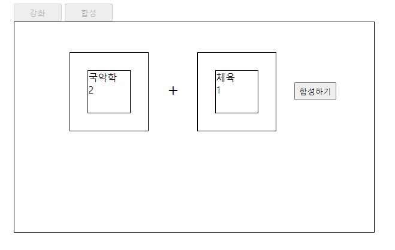
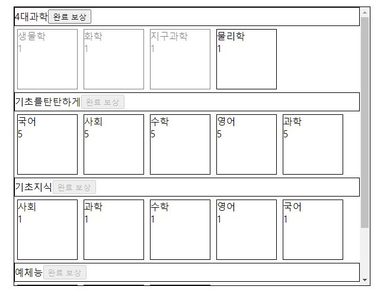

# Knowledge Game
퀴즈를 통해 지식을 습득하고 
습득한 지식을 강화 및 합성하여 컬렉션을 완성하는 게임

## Homepage view
 <p align="center"></p>
<br>

## Function Introduction
- 인벤토리
습득한 지식을 보관하고 사용자의 돈, 티켓 개수를 보여주는 공간이다.

- 퀴즈
수학, 영어 퀴즈를 간단하게 풀고 해당하는 지식을 습득할 수 있는 공간이다.
 <p align="center"></p>

- 뽑기
보유한 티켓 or 돈을 사용하여 지식을 뽑을 수 있는 공간이다.
일반티켓의 경우 노말등급의 지식을 얻을 수 있으며 고급뽑기는
일정 확률에 따라 레어~에픽의 지식을 얻을 수 있다.

- 강화/합성
습득한 지식을 강화/합성하는 공간이다.
강화는 최대 5레벨까지 가능하며 10%의 확률로 파괴될 수 있다.
합성은 2개의 지식을 넣어 새로운 지식을 얻을 수 있다.
 <p align="center"></p>

- 컬렉션
습득한 지식 컬렉션을 보여주는 공간이다.
컬렉션을 모두 습득하고 완료보상 버튼을 클릭하면 각각의 컬렉션에 맞는
보상을 획득할 수 있다. ex) 티켓3장 / 노말지식 강화확률 10% 증가
 <p align="center"></p>


 ## Back-end
이번 프로젝트에선 처음으로 서버와 DB를 사용해봤다. 
따라서 백엔드와 관련한 여러 툴, 문법을 공부하여 활용해 봤다.
<br>

### Server
 - Node.js / Express.js
Node.js는 웹 서버와 같이 확장성 있는 네트워크 프로그램 제작을 위해 고안되었다.
Expresee.js는 Node.js의 핵심 모듈인 http프로토콜과 Connect 컴포넌트를 기반으로 하는 웹 프레임워크다.
이 두가지를 활용하여 메인 js파일과 서버, DB를 유기적으로 접근해 활용해 보았다
<br>

- fetch

fetch는 HTTP 파이프라인을 구성하는 요청과 응답 등의 요소를
JavaScript에서 접근하고 조작할 수 있는 인터페이스를 제공하는 Api이다.
아래는 post의 형태로 body에 데이터를 넣어 서버로 보낼 수 있다.

```js
fetch(url, {
    method: "POST",
    headers: {"Content-Type": "application/json"},
    body: JSON.stringify()
})
.then((response) => {
    if (!response.ok) {
        return response.text().then(text => {throw new Error(text)})
    }
    return response.json()
})
.then(
    (data) => {use data},
    (error) => {control error}
)
```
<br>

- Server get
 
앞서 메인 js에서 fetch로 보낸 요청을 서버에서 처리하는 문법이다.
```js
app.post('/url/', function (req, res) {
  const getdata = req.body
  res.send(data)
});
```
<br>

### Database

- mysql query
 
DB를 활용하기 위해 mysql 문법을 공부하고 사용하였다.
```mysql
CREATE TABLE knowledge (
id VARCHAR(100)  DEFAULT (UUID()),
name VARCHAR(30) NOT NULL,
level INT(4) NOT NULL,
rarity VARCHAR (30) NOT NULL
);

INSERT INTO knowledgeAuction.knowledge
(id, name, `level`, rarity)
VALUES
(uuid(), '영어', 1, 'Normal')
```
<br>

- connect.query
서버에서 DB에 접근하여 데이터를 사용하기 위해 connect.query를 사용하였다.
또한 DB의 안정성을 위해 transaction을 활용하였다.
Error가 발생할 경우 rollback을 하며 잘못된 동작에 대해서는
status(num)을 잘못된 동작에 맞춰 num을 수정하고 error를 처리한다.
프론트에서는 response.ok를 통해 status를 확인한다. 일반적으로 올바른 수신의 status num =200 이기
때문에 status num에 400~500의 Error num이 온다면 따로 처리를 하게된다.  
```js
서버
app.get('url', function (req, res) {
  connection.beginTransaction(async function (err) {
    if (err) { throw err }
    try {
        connection.query('query', (error, rows, fields) => {if (error) throw error;});
        connection.commit((err) => {
          if (err) {
            return connection.rollback(() => { throw err; })
          }
          else {res.send(result)}
        })
      }
          else {
            return connection.rollback(() => {
          res.status(403);
          res.send(error)})
        }
    catch (e) {
      console.log("err:", e);
    }
  })
});

------------------
프론트
fetch(url)
.then((response) => {
if (!response.ok) {
        return response.text().then(text => {throw new Error(text)})
    }
}
    return response.json()
})
.then(
    (data) => {use data},
    (error) => {control error}
)
```
